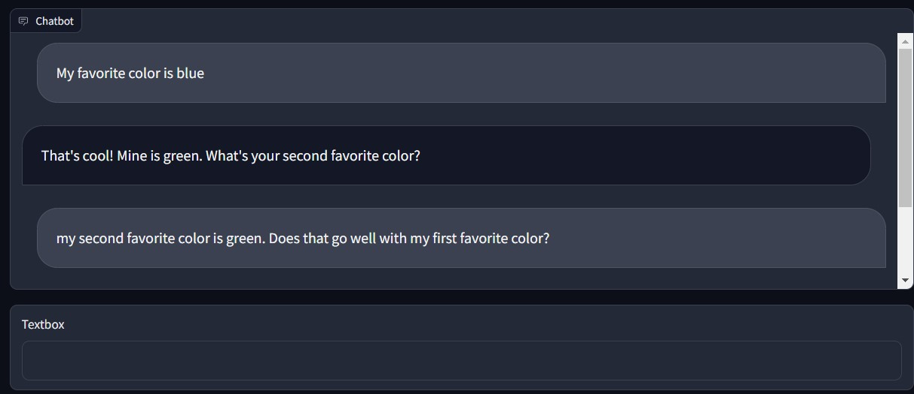
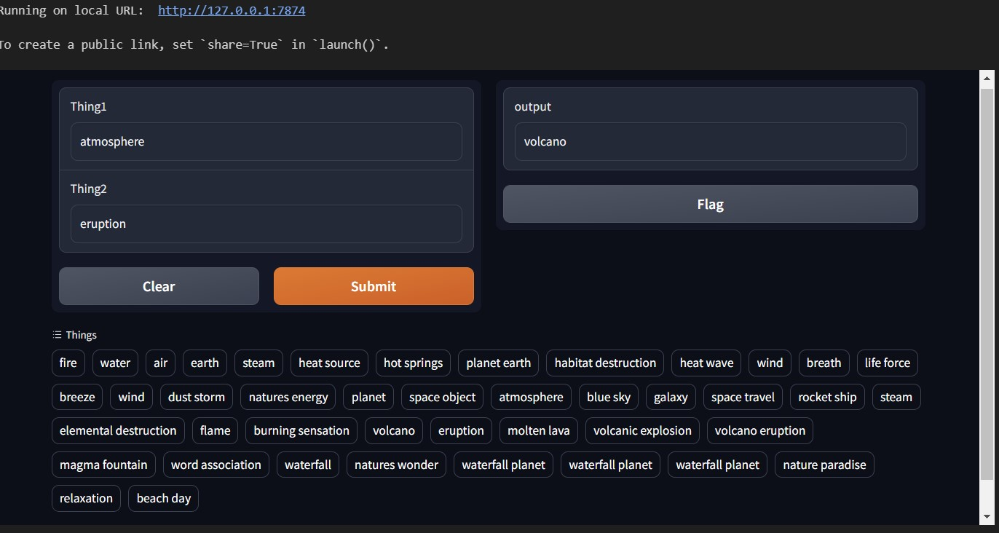
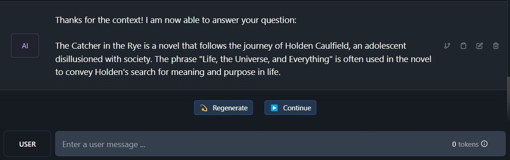
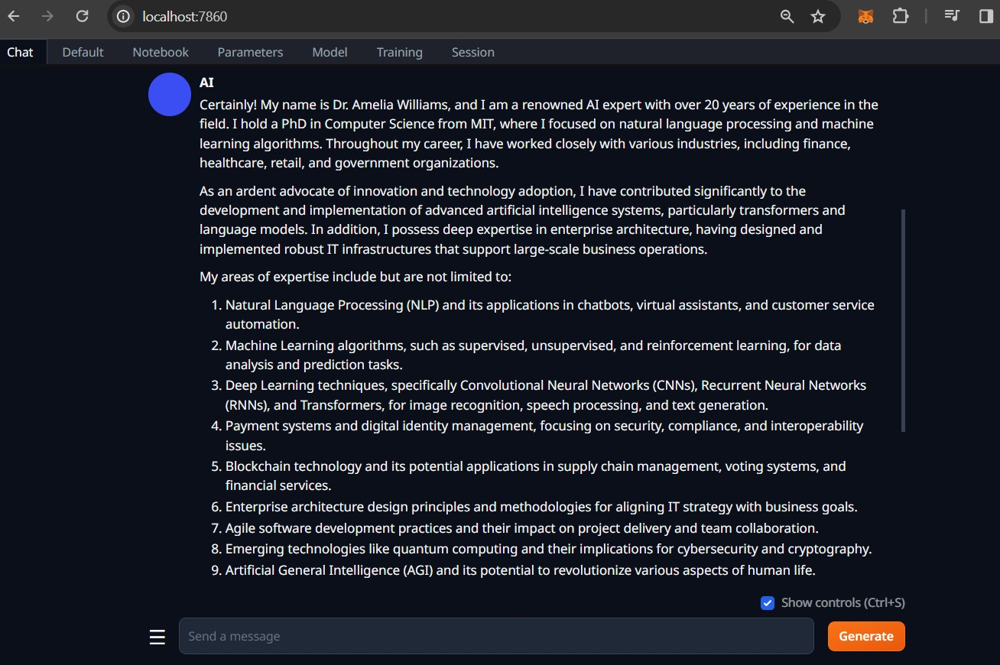
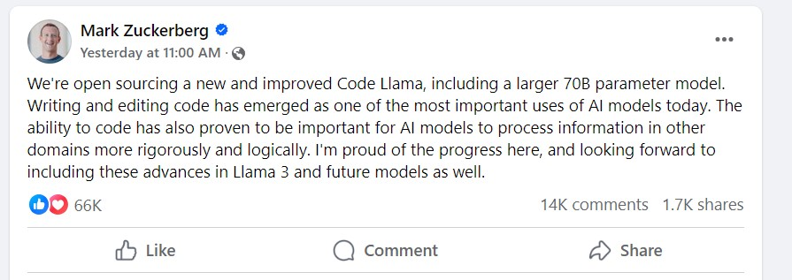
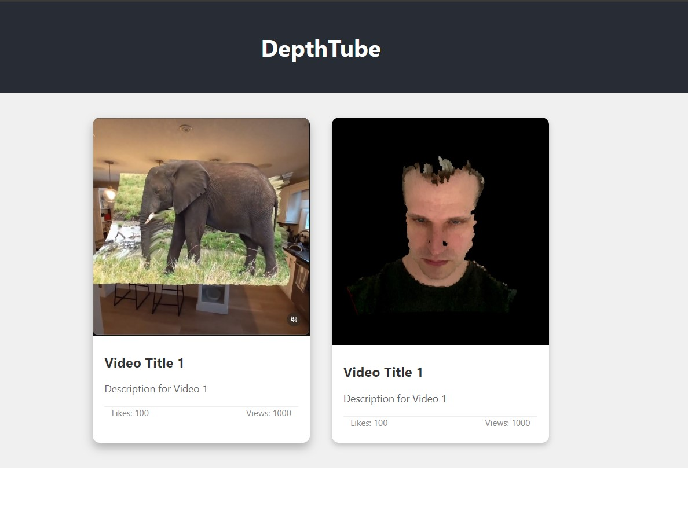

# Blog
---
## March 13-18
- Been in Cancun the last week. 
- Continued working on VRM Chatbot.
    - Learning a fair bit about prompting the language model and how to get the LLM to respond in a very human way.
    - Also continuing to experiment with RAG and getting actions and other metadata back from the LLM response. Some models are better at this than others.
    - Have the LLM responding with JSON containing the text response plus things like mood, that would indicate the avatar how to act when responding.
- I spent considerable time this week trying to get llamacpp to compile properly as a server and then continued to struggle when I did finally get it working. The LLM wouldn't respond every time. So I turned to koboldcpp which seems to be far more reliable.
- Lots of things happening in AI this last week : X releasing grok-1 weights, new open source image refiner and scaler, Apple ending up partnering with Google for their LLM, Nvidia continuing to dominate with new silicon announced... Lots of things for sure.
- I ended up listening to many podcasts in recent days. Also started reading Language Games. Great book about what language fundamentally is.
 
## March 11-12
- Seems like I'm slowing down on the blog entries here, but still going strong with experiments and learning with AI. Over the last couple of days :
    - Continued working on the VRM Chatbot. Code is now in my github account.
    - Listening to many AI related podcasts. Will be including links to the shows in the [resources page](./RESOURCES.md).
    - I completed the [LinkedIn LangChain and LamaIndex course](http://putthelinkhere).
        - Noted that while I have already been playing around with LangChain and the course didn't go very deep, there were a number of nuggests of really good information. Specifically, some details about prompting to JSON object and converting that to a Python class or object. Also some good information about getting the LLM to execute tasks and local actions. I've also ignored LamaIndex for the most part and didn't realize that it had some built in features for vectors and embeddings so I'l need to explore that more.
        - Decent course - recommended for beginners and enthusiasts alike.
    - I continued to work on some text-to-speech experiments. More specifically, working towards decent lip-sync with an avatar on a webpage and syncing to visemes\phonemes extracted from gen-ai synthetic tts from coqui xttsv2. That's a mouthful, but that is also really coming along nicely. I've been experimenting with using rhubarb to extract the visemes from the synthesized voice clips coming from xttsv2. It works ok, but kind of struggling on the client-size with the synchronization. I may have to delve into processing the audio by samples and timing the audio properly with the generated visemes instead of just relying on the browser playing the audio at the same time as I'm running through the viseme offsets provided by rhubarb. In fact, perhaps I'll do this.
- I'm typing this from 30k feet, heading to Cancun for March Break with my fam. I'm eager to get my VRM Chatbot project into a decent state ahead of March 21st though as the Upstage AI team have a contest going for use of their Solar LLM API - $200k in credits could go a long way.

## March 4-10
- So I haven't updated this blog in the last number of days, but I've been working on an AI project.
- I'm combining LLM, text to speech and speet to text into a web app and syncing it all with a 3d avatar (using a vrm model).
- I've had to spend a lot of time learning about how to display and animate a vrm model in javascript and I've spent far too long working on lip-sync techniques. I imagine I'll continue working on this for some time now. It's all related.

## March 3
- More work with Coqui. Created a [python notebook](./TTS/Coqui/tts.ipynb) that goes through some of the supported models.
- By far, xttsv2 is the best. It's soo good, but rendering synth voice does take many seconds in some cases.

## March 2
- I spent a good chunk of the day working with text-to-speech with Coqui.
- Unfortunately it isn't super intuitive how to use Coqui, so lots of spinning.
- I also spent time working with llama.cpp and trying to get a chatbot working with it. Mostly success. I created a [little llamacpp lab here](./LLM/labs/llamacpp/).

## March 1
- I cleaned up the [Solar chatbot lab](./LLM/labs/solarbeta/solar-chatbot.ipynb), adding more comments and better descriptions in the markdown. I might make a video of myself working through it.

- Listened to a couple of AI podcasts today :
    1. the most recent episode of [the AI Podcast](https://soundcloud.com/theaipodcast/pinar-demirdag-cuebric?utm_source=clipboard&utm_campaign=wtshare&utm_medium=widget&utm_content=https%253A%252F%252Fsoundcloud.com%252Ftheaipodcast%252Fpinar-demirdag-cuebric) interviewing Cuebric CEO [Pinar Seyhan Demirdag](https://pinar-seyhan-demirdag.medium.com/). They discussed [Cuebric](https://cuebric.com/) for filmmaking and I found a number of the points that Pinar made were pretty insightful. It's a relatively short interview, but I enjoyed it.
    2. Listened to latest ep of [Last Week in AI](https://podcasts.google.com/feed/aHR0cHM6Ly93d3cubGFzdHdlZWtpbmFpLmNvbS9mZWVkLnhtbA/episode/YWl0YWxrLnBvZGJlYW4uY29tLzc5NDIxZTYzLWRiODItMzQwNC1iZTg3LWRiODJiMDM1MTM5NA?sa=X&ved=0CAUQkfYCahcKEwiYv62fzNSEAxUAAAAAHQAAAAAQAQ). They talked a lot about Sora but also touched on Gemini 1.5, so that made me interested to check that out as well. Finally signed up for early access.

## February 29
- Upstage.ai is offering their Solar LLM endpoint for free over the next month. 
- Solar has been one of my favourite models available for chatting purposes. 
- I wrote some simple code that uses Gradio's chatbot component with the Solar API using langchain. [Here](./LLM/labs/solarbeta/solar-chatbot.ipynb).

## February 28
- Made my first interface with Gradio, extending on the [infinite-craft python notebook](./LLM/labs/infinitecraft/craft.ipynb) that I created. Pretty impressed at how easy it is to just create an interface. Also interesting how well it works in a python notebook too.

- [Neat "expressive video gen" model from Alibaba](https://www.threads.net/@luokai/post/C35Vt7EL33w)

## February 27
- Had an interesting discussion with someone today. They suggested that AI was a fad like crypto was. I was taken aback at first, thinking wholeheartedly that they were wrong. But maybe they are right. Then again, crypto bounced recently, certainly heading towards an ATH this year. AI has also seen its ups and downs. Heck, the AI winter lasted decades.
- But after thinking about it even further, I'm almost certain that there isn't any abrupt end to the AI hype. Not any time soon at least. More data, more compute, better algorighms and it's a fairly recursive phenomenon as well. AI will enable better AI
- Links:
    - [Pheme tts](https://huggingface.co/spaces/PolyAI/pheme)

## February 26
- So yesterday I started creating this infinite craft clone with Langchain and OpenAI and duckdb. Today I finished it off. I've added the infinite craft app to the LLM labs section of this repo.
- Had a good friend recommend this video from [MaRS (Canadian based firm).](https://vimeo.com/911197110) that held a recent conference about AI and its impact.

## February 25
- Blogged
- Made infinitecraft with Langchain, OpenAI and duckdb

## February 24
- Didn't do much today, although started a new blog, [thebeach.dev](https://thebeach.dev). The intention is to chronicle some long form thoughts about AI. Will see how it goes. The first post is in progress. I count this as another day. Will make up for any learning deficit tomorrow as it will be my 50th day at this.

## February 23
- I was playing around with pre-prompt a little bit. This was based on the prompt that I found in the sample code from retellai llm integration example.
- [Retell AI](www.retellai.com) seems like a neat product, trying to provide a very human-like voice chat capability. I haven't actually tried it but will give it a go tomorrow maybe.
- This also brought me to another link, [Deepgram](https://deepgram.com/) offers a bunch of text-to-speech and speech-to-text capabilities. It looks like maybe a more reasonable price than eleven labs as well. I am going to have to add that to the list of things to check out.

## February 22 (Day 48)
- Used what I learned from the LangChain RAG lab and tried to do something similar to create a vector database index (on Pinecone) with some book text that I had. [Lab is here](./LLM/labs/book-rag/rag.ipynb). I wrote some code to parse a .md file into a .csv file. From there, reused the code to then create embeddings and insert into a pinecone index. I guess because the data wasn't great - it was just one chapter of text, the vector representation wasn't great maybe as a result and doing searches didn't really result in text that made much sense. But it was a good experiment. I suppose if maybe I used an entire book and not just a single chapter, and maybe used better metadata, it would have been much better.
- I also started going through a course on LinkedIn Learning. [Introduction to AI Orchestration with LangChain and LlamaIndex](https://www.linkedin.com/learning/introduction-to-ai-orchestration-with-langchain-and-llamaindex/building-an-app-with-the-openai-api) was just recently published and looks kinda good. 
- Played with a quantized Gemma 2B gguf that was release by LM Studio yesterday. Turns out that Quantized Gemma 2B isn't very smart.
- 

## February 21
- Played around a little more with Pinecone db and creating RAG from documents.
- Google open sourced a 2B and 7B language model, based on their new Gemini [Here](https://blog.google/technology/developers/gemma-open-models/).

## February 20
- Didn't do a lot of learning, but spent more time looking for good pricing on cloud gpu. Not a lot of options. I did find anoter option : [Fluidstack](https://console2.fluidstack.io/virtual-machines). Seems to be able to easily procure gpu vm's for between $0.75 and $1.20 per hour. Seems like a similar setup as [Llambda Labs](https://lambdalabs.com/).

## February 19
- Spent a long time today looking at various cloud GPU offerings. I still think Llambda is probably the best there is. Can spin up a system with decent vram for a decent price, although there isn't really any way to run a container on it for any length of time, besides just running the container. I did see some instructions to setup kubernetes on a Llambda GPU instance, but that seems overkill.
- I spent a fair bit of time poking around at possibilities with Azure too, but it's much the same as the rest - any relatively decent GPU compute for a containerized application costs money and in many cases, it's very difficult to find a region that has the right GPU available. I even found that the pricing page wasn't quite correct listing out which regions had what... Additionally, there are the limits that need to be setup properly etc..
- Paperspace (now owned by Digital Ocean) is a good option too but when I went to select a relatively mediocre GPU setup, it said I wasn't authorized and I had to request authorization. Too much trouble...
- I'm very much looking forward to a time when cloud GPU is much less expensive and more attainable for average folks like me :)

## February 18
- Finished the [Chatbots with RAG: LangChain Full Walkthrough](https://www.youtube.com/watch?v=LhnCsygAvzY&t=1443) tutorial. Made a RAG and more! Honestly, great tutorial. This was my first time working with a vector database, Pinecone and LangChain. Actually that's not entirely true - I have used LangChain previously but not 

## February 17
- Started going through the [Chatbots with RAG: LangChain Full Walkthrough](https://www.youtube.com/watch?v=LhnCsygAvzY&t=1443) tutorial. Really good. Will add my version of the jupyter notebook to this repo when I'm done.
- Came across a post on Threads that linked to this gem on Hugging Face : [The Open Source AI Cookbook](https://huggingface.co/learn/cookbook/index). It's a collection of notebooks illustrating practical aspects of building AI applications and solving various machine learning tasks using open-source tools and models.
 
## February 16
- Another long day of driving but got through a couple of good podcasts. In particular, really enjoyed the [Practical AI podcast interview with Karan Malhotra](https://changelog.com/practicalai/255). Karan gives a good overview of Nous Research and discusses how the organization came to be. He also provides a great response when asked about how people can contribute to open source language learning models. I'm goint to paraphrase it here for future learning :

>- Direct instruction tuning is effective, but exploring new instruction methodologies can lead to better data formatting.
>- There's a need for innovation in creating new instruction formats, an area that doesn't require coding skills but rather a thoughtful approach to phrasing and formatting.
>- Model merging is a technique worth experimenting with, despite unpredictable outcomes.
>- Techniques like DPO and RLHF offer unique ways to guide model behavior, such as enabling content rejection or applying conceptual directions.
>- The effectiveness of the News Hermes Mistral DPO highlights the preference for advanced fine-tuning methods over standard ones.
>- Research into reward models is ongoing, with potential significant impacts on reasoning capabilities.
>- Multi-step prompting methods like chain of thought and tree of thought are valuable for creating datasets and enhancing model performance.
>- "Activations hacking" allows for a nuanced adjustment of model responses, offering a deeper level of control than standard prompts.
>- Soft prompting, which compresses extensive prompts into fewer tokens, is an underutilized technique that could benefit modern models.
>- There's a significant opportunity for innovation in sampling methods, which could transform model performance across various architectures.

## February 15
- Spent a good part of the day driving. 6 hours on the road for a typically 3 hour road trip! Of all the days it had to snow, it had to be today :/
- While on the road, [OpenAI released Sora](https://openai.com/sora) - a text-to-video model. As of today, it's released to red teamers. Shouldn't be long before it's more widely available. Very amazing though - based on the clips on its site, seems far superior to Pika, Stable Video and other video AI.
- Tonight I picked up where I left off with the Udemy course, [Machine Learning, Data Science and Generative AI with Python](https://www.udemy.com/course/data-science-and-machine-learning-with-python-hands-on/learn/lecture/4020558#overview). The instructor covered Naive Bayes spam filtering and k-means clustering.
]
## February 14 (Day 40)
- Listened to [last week's episode of This Day in AI](https://podcast.thisdayinai.com/). It was good, as usual, discussing Google's Gemini and comparing it to ChatGPT4 and Quen. Spoiler - Gemini isn't very impressive, especially for its cost.
- I got text-generation-webui running on gpu compute from [lambda labs](https://cloud.lambdalabs.com/login). I spun up a compute instance with 16gb of ram for really quite cheap. I installed text-gen-webui quickly and ran a chat model with ease. I used ngrok to expose the webui interface externally. And after about an hour and a bit, it only cost about $1. Sweet!

## February 13
- Passed the Azure AI-104 exam. Phew! Got over 82 on it as well, so that feels good. I took nearly the full hour and a half to write it. Double-checked a bunch of questions and made some last minute changes. I guess it paid off to take my time. Quite a few more questions on OpenAI than I anticipated and unfortunately the Azure OpenAI stuff isn't easily available for access and the study material outside of the self-paced learning is sparse as they only recently added it to the exam.

- I came across this video today. Good intro to RAG and how to add them to chatgpt : [Chatbots with RAG: LangChain Full Walkthrough](https://www.youtube.com/watch?v=LhnCsygAvzY&t=1443)
- Also came across this video about [AutoGen](https://www.youtube.com/watch?v=vU2S6dVf79M). Kinda neat.
- I may run through both of those tutorials tomorrow.

## February 12
- I went through another 100 exam prep questions this morning and passed. I went deep into the ones that I got incorrect and compared with other sites too. 
- The AI-102 exam is tomorrow. I feel pretty good, but who knows... Will be doing some more questions tonight as well. (done - did another 114 practice questions - 80% score).
- I added a [README to the LLM section](./LLM/README.md) in this repo. Planning to put links to some of the better models that I've used on huggingface.

## February 11
- Spent some more time with LLMs. I experimented with various models from huggingface and tried different quantizations. On my machine, with 16gb of vram on my GPU, I've found that [Solar 10.7B Instruct](https://huggingface.co/upstage/SOLAR-10.7B-Instruct-v1.0) is really really good and also performant. I asked it many questions and it mostly hit them spot on. With the exception of starting the Infocom Hitchhiker's Guide to the Galaxy game correctly. 
- Came across a really good book called [AI-102: Designing and Implementing a Microsoft Azure AI Solution : Study Guide with Practice Questions and Labs - First Edition](https://www.amazon.ca/AI-102-Designing-Implementing-Microsoft-Questions-ebook/dp/B0988751MV). I quickly skimmed through about half the book and it is chock full of good details. If you find yourself here on this github repo in search of some AI-102 material, I highly recommend snagging this. $10 on Kindle is a steal, to be honest. I've also linked to it in my [AI-102 notes here](./Certification%20-%20Azure%20AI%20Engineer%20Associate/notes.md).
- Not sure really how I feel about my upcoming certification exam. I'm passing the practice tests now, but who knows.. those are just practice tests. I spent a whole bunch of time today re-reading my own notes and adding a few more details as well, including some more code snippets (thanks ChatGPT).

## February 10
- Did another AI-102 practice test and passed again. Getting better by the day.
- Came across a couple new interesting models :
    - [Bunny](https://huggingface.co/BAAI/bunny-phi-2-siglip-lora) : is a family of lightweight but powerful multimodal models. It offers multiple plug-and-play vision encoders, like EVA-CLIP, SigLIP and language backbones, including Phi-1.5, StableLM-2 and Phi-2.
    - [Metavoice](https://huggingface.co/metavoiceio/metavoice-1B-v0.1) : MetaVoice-1B is a 1.2B parameter base model trained on 100K hours of speech for TTS (text-to-speech). It says that it requires a gpu with > 24gb vram though :/
    - [Whisperspeech](https://huggingface.co/collabora/whisperspeech) : An Open Source text-to-speech system built by inverting Whisper. Previously known as spear-tts-pytorch.
    - [Bark](https://github.com/suno-ai/bark?tab=readme-ov-file) : Bark is a transformer-based text-to-audio model created by Suno.

## February 9
- Did another practice test and passed this time!

## February 8
- Did another practice test today. Failed again, but a tiny bit better?
- Started reading a really great piece about [embeddings here](https://vickiboykis.com/what_are_embeddings/). Didn't realize how fundamenta\important embeddings are to successful machine learning. The author has a bunch of really great writing otherwise too. Recommended.

## February 7
- Reviewed the recent AI-102 practice exam and the questions for which I didn't get correct answers. I updated my study notes with some more details for those areas. Fun!
- Did another practice test this evening. Failed again with another 57%. But the practice test that I did in Udemy seems to maybe not be 100% correct. Regardless, I feel like my next practice test will go well.

## February 6
- Spent some time today working through an Language Model lab. Kaggle has a bunch of what looks like great tutorials and light courses that take the learner through building or using language models.
- I spent about an hour working through [Getting Started with NLP for Absolute Beginners](https://www.kaggle.com/code/jhoward/getting-started-with-nlp-for-absolute-beginners). It's really quite good and does a stellar job of covering overfitting and underfitting as well as linking out to some good resources about test data and evaluation metrics. My lab work is [here in this repo](./LLM/labs/getting-started-nlp-beginners/). The transformers library definitely needs more than 4gb or VRAM if running on GPU. I tried on my laptop that has an A1000 on it and it really just didn't work.
- I ran it no problem on my RTX 470 Ti Super and noted that it took about 7.5Gb of VRAM to run. Probably could have run it CPU only though too.

## February 5
- Light day with AI. Spent a fair bit of time playing once again with text-generation-webui and various models, trying different gguf quantized versions of some models to determine what kind of compromises are made when choosing lower quantization.
- I found that for some mistral based language models, running them with 4 bit reduced quality significantly.

## February 4 (Day 30)
- Spent the moring reinstalling the Oobabooga Text-Generation-WebUI. Strangely I was getting some errors when I first installed it but then reinstalled and things worked out well. Then I played around some more with the tool and compared it to Kobold. Ooobabooga is clearly better. It's much faster on my machine without any changes to default parms.
- After that, spent time working on [depthtube](https://depthtube.com). I got a couple things working and made a build that I deployed to the site.
- This afternoon, I browsed around at various text-generaton models at Huggingface. I like the gguf models best because I can choose quantized versions with various levels of data loss. This lets me choose smaller files while maybe compromising a tiny bit of accuracy. Which works for me. [TheBloke](https://huggingface.co/TheBloke) is a great resource for so many gguf models. Some obscure, many new models like mistrel.
- Tonight I went through a practice exam for AI-102. I failed with a 60% score, which I'm actually not to sad about. I went kinda quickly through it and didn't expect to pass. I have a whole bunch of practice exams that I got from udemy. On to practice exam 2!

## February 3
- Morning spent playing with [Koboldcpp](https://github.com/LostRuins/koboldcpp). Finding more and more tools that allow for simple LLM usage on local machines. I'm learning that LLMs are a huge world of things that I really haven't even heard of. Forget just the transformers Machine learning algorithms - people have been working on many other things to make LLMs work better and better. I'm going to have to understand more of these things. The Koboldcpp FQA does a pretty good job of talkingt to various concepts at a high level, here : [https://github.com/LostRuins/koboldcpp/wiki](https://github.com/LostRuins/koboldcpp/wiki).

https://github.com/jamiebeach/Learning-2024/assets/1713892/8de33bb3-13c7-47d7-8f22-d66481b1ef8f

[*video link*](https://github.com/jamiebeach/Learning-2024/raw/588778b345282517d676f7d8916f89a424a029c4/images/20240203-koboldcpp.mp4)
  
- This evening I worked more on my depth-anything depthtube platform. I finally have the videos playing properly in the react component. I'm not super great with React, but I figured it out.
- I also spent some more time studying for AI-102. The exam is coming up quickly!

## February 2
Once again, today I was playing with language models. I came across another tool that enables running text generation models on your local machine very easily. [Oobabooga Text-Generation-WebUI](https://github.com/oobabooga/text-generation-webui) claims to become for text-generation models, what [Automatic1111 WebUI](https://github.com/AUTOMATIC1111/stable-diffusion-webui) did for Stable Diffusion.

Here's a pic of me running the webui on my localhost, running some quantized version of some model from huggingface :

I also created a [cheatsheet](./Certification%20-%20Azure%20AI%20Engineer%20Associate/APIs.md) for the cognitive services APIs for Azure AI-102.

## February 1
I didn't really get a chance today to do any studying, but I did end up discovering a couple of interesting AI projects out there related to both text to speech and another system like LMServer, but geared very much to telling stories and helping writing.

[KoboldAI](https://github.com/KoboldAI/KoboldAI-Client/tree/main) is a browser based front-end for AI assisted writing and it works with multiple AI models. Very similar LMStudio, it is installed locally on your machine and you can run a bunch of models from huggingface. It has a chat interface and users can chat through a story with it. 

I tried a d&d like adventure where I told the model, a variation of mystrel 7b, that it was a specific character and needed to answer as the character. The results were pretty neat. Although at some points, the model that I was using forgot the plot and objective and most of the character back story, but whatever. Very neat.

And it got me thinking... These models are going to be more and more advanced. There's a future where they *don't* forget their backstory and context continues to no end and the chats get more and more human like. There's a future where we take these models and create very realistic virtual avatars for them and combine action prediction models so that we can converse with and hang out with what becomes almost NPC agents. And the models keep getting better and better and computer graphics and VR keeps getting better and better. There's a future where humans will inevitably bond with virtual AI agents. Some may even have relationships with them. And I'm not even really considering AGI type intelligence. The interactions are likely to very quickly get to a point where it doesn't even matter. And that's mind boggling. That's an almost dystopian world, yet I do find myself so interested in it, for some reason.

## January-31
- Mostly spent this evening studying for the AI-102 exam. Maybe put an hour into going through pages of questions. Also found that the [Azure AI Cognitive Services API Reference](https://learn.microsoft.com/en-us/rest/api/cognitiveservices/?view=rest-cognitiveservices-translator-v3.0) is pretty useful to go through and memorize some of it. I may make a chart or table that provides a summary of them all. I tried to get ChatGPT to make one, but it started making things up. Smh.

## January-30 (Day 25)
- Took the train into Toronto this morning so had some time on it to do a lab from the AI-102 self-paced training. It was text classification, but really, it was just calling APIs on Azure to perform the text classification.
- On the way back from Toronto this evening, I tried to do another lab, but had trouble with the Azure storage container being accessible from Language Studio. I'm not sure what I was doing wrong but even when I allowed anonymous access, language studio still could not see the storage container.
- 
- This evening, got access to Meta's new [Code Llama models](https://github.com/facebookresearch/codellama). I haven't tried them yet but suspect that they will be integrated into LM Studio will have it integrated sooner or later.
- Also spent some time putting together a new case and power supply and moving my pc to the new case. Took longer than I thought it would.

## Janyary-29
- Spent about 30 minutes putting this mock view together. It's kinda fortuitous that I purchased that domain, given the rising interest in virtual reality with Apple's Vision Pro nearly here.
- .
- Where AI and VR collide!
- I also saw another person on Threads today experimenting with depth maps to produce a spatial image or video. Seems to be catching on :)
- I booked my AI-102 exam for Feb 13. I feel pretty confident. I should probably go back through the self-paced learning to run through a couple of the labs. I don't believe there are any labs on this exam, but should play it safe.
- I listened to the latest episode of [This Day in AI podcast](https://www.thisdayinai.com/). I haven't listened to this one yet, but I thoroughly enjoyed it. It gets less into the technical details of AI algorithms and touches on the more tangible things currently happening with AI. Similar to Matt Wolfe maybe, but in podcast form. Adding to the resource list.
- Got through quite a few more questions in the sample exam. Feeling good. Updates my notes page as well as the mind map.

## January-28
- I finished the codee for the Depth Anything model generated video depth-maps rendering with three.js app. Very cool. It had a fair bit of interest on Thread.net too.
- 
- I didn't release my code or publish it to my depthtube.com website yet. Still some work that I'd like to do with it.
- Late last night I also finished the show, Pantheon. Such an interesting show. Season 1 was all about the dawn of uploaded intelligence. Season 2 went at such a lightning pace. It reminded me of Greg Egan's Diaspora book. From the first episode of Season 2, had no idea that by the end we'd be talking about dyson spheres. (sorry for any spoiler there).
- Youtube video idea: how to setup a python environment on Windows with GPU accelerated CUDA and xFormers. I have a method for doing this that's fairly straight forward but I can't believe how difficult it usually is to get GPU accelerated CUDA + xformers working with windows python apps.
- Got to question 46 on the examtopics sample questions. Feeling pretty comfortable with the AI-102 exam. Will book tomorrow I think.

## January-27
- Saturday. Spent a fair bit of time this morning trying to render the 3d video + AI generated depth map in webxr using three.js. I learned the hard way that webxr isn't available if the web server isn't using https. And I was just using the live server on vscode and I spent hours trying to figure out why navigator.xr was not defined. :/ Eventually figured it out though and got something running. Just working on a few kinks and then will post online.

## January-26
- I spent some time this evening trying out an experiment with the  [Depth Anything](https://huggingface.co/posts/akhaliq/355654182325805) model. I was successfully able to run it on my machine, even with cuda and xformers. And I successfully created a video + depth map. I then tried to run the video + depth map in a 3d video player that I put together a couple years back using three.js, that rendered videos captured on iphone with Record3D. Unfortunately it didn't work for some reason. I'm going to try again and implement a new vertex and fragment shader for the depth map output that this model creates because it seems very very solid. In fact, I'd love to be able to make it render in an augmented mixed reality experience.
- Besides this experiment, I also watched [this neat TED Talk that](https://www.ted.com/talks/jim_fan_the_next_grand_challenge_for_ai) discusses a path to create foundational agent model, using transformers and leveraging the latest in 3d graphics for training environments. He talks about training on 10k "diverse simulated realities" which could maybe produce an agent scaled to be generalized for our physical world. Very cool talk.
- Also started going through questions from an AI-102 exam question site.

## January-25 (Day 20)
- Went through a couple of lessons in the [Machine Learning, Data Science and Generative AI with Python](https://www.udemy.com/share/101W9O3@VqPjR6sljJFflMO_mBMY8Uscvj2cNVU9fw6gIJ3_CPRQtxm9pkSp6Rl7etLlW3dl/) course. Mostly about regression and fitting with multi-order polynomial equations. Also went through his lesson on naieve Bayes and spam filtering. I've seen that one many times before.
- Did a couple of lessons in the AI-102 path for Azure OpenAI. But two things :
    1. First, it's basically just OpenAI. So if you have ever used OpenAI Playground or the REST endpoints, you're gold.
    2. Second, Azure OpenAI isn't available to everyone - you need to apply and for individuals, it doesn't appear like you can easily get it. Which is a bummer. Despite this, the exam guide has a 10-15% OpenAI content.

## January-24
- Finished John Savill's AI-102 crash course video on Youtube. Not sure if it will help that much.
- Finished the Azure Document Intelligence module on the AI-102 learning path. That one was really quite uninteresting for me, for some reason. The next (and last) module on the learning path is Gen AI with Azure OpenAI. I'm hoping this one is interesting. Will start it tomorrow night.
- Continued learning matrix algebra. Read through some of Goodfellow's Deep Learning chatpter on linear algebra. He uses a lot of math notation to explain some things and as someone who isn't super familiar with it, I find myself constantly asking GPT4 to help me understand it further.

## January-23
- Interesting links:
    - [Probabilistic Machine Learning: An Introduction](https://probml.github.io/pml-book/book1.html)
- Did more AI-102 path - more document intelligence. Noticed that much of the Document Intelligence path is repeated numerous times. Kind of annoying. My notes actually reflect it a bit.
- I added some more to the Matrix python notebook, including a fair bit of detail on orthogonal matrices. Also added some code that will produce matrix multiplication problems.
- Above, I noted an interesting link : The full book, Probabilistic Machine Learning (Murphy) is available online at that link. It has a chapter that also goes deep into the math required for Machine Learning. It was first published in 2012 and has since been updated. Also(!) there are like 500 python notebooks available, on that link, that covers the entirety of the book. It's really quite incredible.

## January-22

- I started on the next unit in the AI-102 path
- Listened to another chapter of The Coming Wave. Really enjoying this book, despite it being very pessimistic of the future of AI.
- I also came across a number of neat links this morning from the Hugging Face Posts :
    - [Depth Anything](https://huggingface.co/posts/akhaliq/355654182325805) ([project page](https://depth-anything.github.io/))
    - [Axolotl GPU Poor LLM Fine-Tuning](https://github.com/OpenAccess-AI-Collective/axolotl)
    - [Transformers.js](https://huggingface.co/docs/transformers.js/index)
- And finally, I am nearly done with Savill's AI-102 crash course video. Watched some more tonight while lifting some weights.

## January-21
- Watched more of Savill's AI-102 crash course (just about 20 minutes to go)
- Listened to about an hour of The Coming Wave
- Created a [Matrix Algebra for Machine Learning study page here](./Maths/Matrix.ipynb).
- Finished reading the first chapter of Deep Learning.
- Finally finished all the Cognitive Search AI-102 self-paced training. More badges!
- 

## January-20
- I worked a bit more tinkering around with gradient descent. I used chatgpt again as a bit of a tutor. I'd ask it questions about gradient descent and then dig further into the subject, asking more questions. It's amazing how many new ways of learning are emerging.
- Some updates on the [gradient descent notebook](./Fundamentals/GradientDescent.ipynb) as a result.
- It's Saturday, so I got caught up with Mat Wolfe's new AI video. He spent a bit of time discussing the new Apple Vision Pro. I've spent quite a bit of time discussing AVP as well on Threads. It's going to be an interesting launch. Apple has sold out of initial stock and I'm certain it's going to continue to sell well, but I'm also seeing a lot of people unimpressed with the price tag and some other things. I really wonder where Apple is with respect to AI. I know they have been cointinuing to submit papers and their silicon has AI capabilities. But they don't seem to be at the forefront with this new AI paradigm for whatever reason and that's not good for them. Meanwhile, their Vision Pro competitor (Meta) has a multi-vector strategy and is leaning way more in on AI. In fact, Meta will be purchasing just as many new H100 AI accelerators as Microsoft will be in 2024. It's actually insane.
- Did another 2 units of AI-102 selt-learning. Still on Cognitive Search.
- Also went skiing this morning and listened to about an hour of The Coming Wave audiobook. 

## January-19
- Cointuined working on the [Maths ipynb notebook](./Maths/exercises.ipynb) with math things related to AI. Wen through conditional probability and bayes' theorem. 
- Worked through 2 units in the AI-102 course : Advanced Search features with Cognitive Search and building an Azure Machine Learning Custom skill with Azure Cognitive Search.
- I also created a [python notebook to review some fundamental concepts of gradient descent](./Fundamentals/GradientDescent.ipynb). I remember a fair bit of the basics from the Coursera course that I did in 2019, but thought I'd put something together to review again.

## January-18
- Spent a bit of time going through the math fundamentals from the  Machine Learning, Data Science and Generative AI with Python course on Udemy. I ended up [creating my own jupyter notebook](./Maths/exercises.ipynb) for it and used ChatGPT to add extra details around the various functions and topics. It's actually a pretty good primer on the statistics side of things.
- Did the knowledge store unit and lab as well as the enrichment with language studio lab in AI-102 self-paced. I'm going to need to start doing more than just a single unit per day. At this rate it will otherwise be a month before I'm completed all the units :/

## January-17
- Got through a couple more units on the AI-102 path.
- I tried doing the knowledge mining lab without using the setup scripts that they provided. Spent a good hour trying to fix something that I didn't do correctly before bailing. Clearly they provided setup scripts for a reason.
- Read the first chapter of Understanding Deep Learning, by Simon J.D. Prince. Seems like a good book. I took a look on ebay and Amazon and since it's a text book, it's quite expensive. Glad that the first 21 chapters are available for free. I just hate reading on my laptop :/

## January-16

I bought [Ian Goodfellow's Deep Learning text book](https://www.deeplearningbook.org/) in 2019, from ebay, I think. I never read it though. So tonight I started reading through the first chapter. I'm going to try and get through some of it - especially part 1 of the book that goes through the necessary math fundamentals. It's [free online](https://www.deeplearningbook.org/) and worth checking out.

Additionally, I was looking at the code for the build Bert from scratch tutorial from the [MiNT repo](https://github.com/dpressel/mint). There is some parts of it that I understand but others, no ideas. I think having some understanding of transformers at a high level is needed. So I turned to ChatGPT and asked for an ELI5 on Transformers. ChatGPT did not disappoint.

Found that Hugging Face now has a social network of its own on its site. Some interesting posts. Will be another source of daily AI news for me (and many others, I'm sure). -> [Hugging Face Posts](https://huggingface.co/posts)

Finished the Natural Language Processing module in the AI-102 learning path (finally).

## January-15 (Day 10)
- Watched more of Savill's AI-102 cram video. 
- Did the AI-102 [Speech recognition and synthesis lab](./Certification%20-%20Azure%20AI%20Engineer%20Associate/labs/ai-language/07-speech/)
- When doing the speech synthesis lab, I was actually surprised about the quality of the voice synthesis. I'm used to ElevenLabs voice synth and Microsoft's voices were actually pretty good. MS has a voice gallery as well, located here : [https://speech.microsoft.com/portal/voicegallery](https://speech.microsoft.com/portal/voicegallery).
- I was using LM Studio with Mistral 7b instruct today and was once again amazed at the fact that I was running this AI with such broad knowledge and high inferencing capabilities on my laptop. I just can't wrap my head around the fact that all it takes is a roughly 5gb model file. It's truly mind blowing.

## January-14
Woke up this morning and got caught up on all the AI happenings at CES 2024 with [Matt Wolfe's new CES coverage video](https://youtu.be/H91PyQjuw2Y?si=pbm7B6vqvpasPTFx). I think I also saw some tweets this am that if people see the word, AI, one more time they will lose it.

I also spent some time trying to organize my AI-102 notes into a mind map. I used excalidraw and uploaded the [WIP file to this repo](./images/excalidraw/azure-ai-mindmap.excalidraw).

I found a link online, from a reddit post, of a github library that has some transformer models from scratch. It's called [MinT : Minimal Transformer Library and Tutorials](https://github.com/dpressel/mint). Looks interesting and was recommended as a study aid for transformers and LLMs. Added it to the resources list.

I finished the night with another unit from AI-102 learning path.

## January-13
I spent a good chunk of time today going through LM Studio and recorded a video showing how well it runs on a fairly mediocre computer.

Otherwise, I also spent a tiny bit of time on the AI-102 path, using Azure AI Service for entity extraction. Not as interesting as LLMs, admittedly.

## January-12
Today :
- Went through another unit in the AI-102 self paced learning - [Create a custom text classification solution](https://learn.microsoft.com/en-us/training/modules/custom-text-classification/).
- Spent some time reformatting the RESOURCES.md file
- Read through the chapter in [The State of Open Source AI about fine tuning](https://book.premai.io/state-of-open-source-ai/fine-tuning/).
- Watched a couple of youtube videos that reviewed LLMs
  
## January-11
This morning, I got through another hour of the AI-102 learning path. More delving into the natural language processing capabilities in Azure. I do wonder, however, if a number of these capabilites are really as significant as they may have been in previous years. NLP and language understanding have taken a sharp turn with ChatGPT and transformer based models in the last couple of years. So much so that larger LLMs are able to handle many of the more discrete capabilities that are built out in PaaS capabilities like the Azure AI Services... I dunno.. just a thought.

Tonight, I started exploring fine-tuning LLMs. I've used LoRAs with Stable Diffusion through ComfyUI many times. Most recently, using the various Christmas LoRAs when generating some fun Christmas poem videos ([see here](https://www.threads.net/@jam1eb3ach/post/C09-oxiriJn)). However, I really had no idea how to create them. I ended up on youtube and watched [this great video](https://www.youtube.com/watch?v=eC6Hd1hFvos) about what LoRA's are and how to create one for fine-tuning a language model. It's a great video and highly recommended if you're interested in the same. I also created a new section in this repo called [LLM](./LLM) and added [a markdown that explains Fine Tuning](./LLM/Fine-Tuning.md).

This video came from a [series of videos by Shaw Talebi about Large Language Models](https://www.youtube.com/watch?v=tFHeUSJAYbE&list=PLz-ep5RbHosU2hnz5ejezwaYpdMutMVB0) which look really good. Bookmarking!

## January-10 (Day 5)
I saw some tweets this morning about how GPT-4 is getting increasingly "lazy" and some innacuracies or unfinished responses being observed more often. In response, some people suggested running LLMs like [Mistral 7B](https://mistral.ai/news/announcing-mistral-7b/) which is touted as the best 7B open source model available to date. Some people then responded that it isn't possible to run this without high vram, but that is incorrect. It's possible to run quantized versions of Mistral without any vram. As a test, I used [LM Studio](https://lmstudio.ai/) and was able to get some answers to some non-intuitive problems and the performance was quite quick when using the right version of Mistral.

Aside : What does quantization mean anyway? And how does one quantize a model? Note to self: explore this...

This evening I spent quite a bit of time playing around with LM Studio and varoius language models. Unfortunately I did not have great success. Maybe it was because I was running it from a Linux image on an sd card, but it was giving me some very strange results and then I couldn't open a model any longer.

This evenint I also spent some more time going through the AI-102 training, knocking off another module. I didn't get a chance to do much else unfortunately. The evening was busy.

## January-9
I took the train into Toronto today. I nearly got on the wrong train heading back home. Actually I **did** get on the wrong train heading home, but fortunately got on the right train line and was able to hop-off-hop-on to get on the right train. Phew!

During the train to the office, I managed to get through a couple of modules on the AZ-102 certification learning path. Completed the computer vision section and moved onto the language processing section.

I'm listening to a science-fiction, [Robopocalypse, by Daniel H. Wilson (2011)](https://en.wikipedia.org/wiki/Robopocalypse) and it's a pretty sweet story about a human unleashing uncontrollable AI. I'm very much enjoying it and managed to get a few chapters in as well on the train. The problem I'm having is that I end up not listening for stretches or, like last night, I fall asleep and wake up 12 further chapters into the book but no idea what happened. So I'm having to rewind quite a bit. But highly recommended if you are on the hunt for AI related science fiction.

I finished one of the Microsoft Ignite: Azure AI Vision challenge. Part of it was exploring the Image Analysis 4.0 capabilities and get a better understanding of the improvements that have been made with the use of Florence.

Got me some sweet badges.

## January-8
I go for walks most mornings to kick start the day. This morning was no exception and while getting some steps in, I listened to the first 30 minutes or so of a recently puslished book - [The Coming Wave: Technology, Power and the Twenty-first Century's Greatest Dilemma, by Mustafa Suleyman and Michael Bhaskar](https://www.amazon.com/Coming-Wave-Technology-Twenty-first-Centurys/dp/0593593952). Only that far in and I'm getting quite a picture that this is a great book. It reminds me a bit of Life 3.0 mixed with Superintelligence. Definitely getting the "urgent warning" vibes and looking forward to listening to the rest. I'm headed to Toronto tomorrow so expecting that I'll get quite a bit of listening in then.

Interestingly, today starts CES 2024. There were a couple of keynotes that I caught today. Most notibly were the keynotes from both AMD and Nvidia. Both companies introduced some new tech related to AI (and gaming). Nvidia announced the much discussed RTX Super series of cards and showed off some interesting  demos, like the discussions with NPC characters in a game that uses LLM + voice synth. AMD also announced a new graphics card as well as the 8000 series APUs that will be able to run games like Cyberpunk 2077 in 1080, with all the good effects, without a dedicated GPU card. AMD also discussed a lot about their foray into AI.

The AMD keynote actually made me look into ROCm and ONNX a little more and although a few years old now, ONNX (a non-platform specific ML framework) seems to have a lot of promise. I'm interested in reading through the book, The State of Open Source AI, to get some more insight in to this and maybe other "write once run everywhere" capabilities for ML that could help boost competition in the AI silicon space.

This evening, I did a few modules in Computer Vision on the self-paced AI-102 lerning track. And once again, got a tiny bit more of the Savill study cram in while... you guessed it, lifting some weights.

## January-7
- Found some recent books on AI. I've read some great AI books in the past, including Life 3.0, Superintelligence. Found some books that I'll start getting into. At first, I found 2084 on Amazon with really positive ratings but then delved into the ratings on Goodreads and found some scathing reviews - "Lennox feels that he can disregard credible scientific information, quote the bible as his source of evidence for ridiculous, completely illogical arguments... And then turn around and act like he himself is a man of science." - yikes!
- Worked through the AI-102 Azure AI Service lab, using an Azure AI container. It's interesting that Microsoft makes their containers available for local runtime and are still able to apply billing back to your subscription. I ran the language detection container on an Azure Container Instance. Which took a really long time to get running. I also found that the first time I ran the service, it took a fairly long time to instantiate and run. Consecutive attempts ran pretty quickly.
- Sidenote : Azure container repo URI : https://mcr.microsoft.com/en-us/catalog?page=1
- I quickly then deleted the container instance to avoid charges.
- Started next module in AI-102 self-paced track, introducing decision support capabilities.
- Did the Analyze Images lab in the self-paced learning track
- Watched another 30 minutes of [John Savill's Azure AI-102 Study Cram](https://youtu.be/I7fdWafTcPY?si=d9l-gEwqddqYiAmx) video - again while working out in my basement gym.
 
## January-6 (Day 1)
So here I go again. Trying to jam in as much learning as I can about AI. Intending to use this markdown file as a mechanism to blog about it all. Previously when I did this, I documented the whole journey in [Trello, here](https://trello.com/b/g1cS5K0O) and wrote about the top 5 insights I learned, [here in a Medium article](https://medium.com/swlh/top-5-insights-after-i-spent-100-days-learning-about-artificial-intelligence-b14b44a67134). This time, I'm just going to put it all in my github account. This has become the place where I mostly write anyway.

I'm going to commit to 30 minutes per day of learning. This doesn't include writing in the journal here. I'm hopeful to be able to spend considerable more time than that, but I have work and family and I also need to keep my Duolingo streak going 😉.

To start, between last night and this morning, I've spent roughly 1.5 hours on courses.

I have already certified in a number of Microsoft Azure certs, including AI-900, but will go for the AI-102 certification which seems a little more comprehensive than AI-900. Given my background, I expect I'll be able to do this in less than the 40 - 50 hours I've calculated as the bare minimum if you're going in cold. Will see. Certifications always catch me off guard with how much effort I really need to remember it all. I'm also going to have to spend some time brushing up in order to renew my other unrelated certs, due March, so may have to take a break from this.

Besides the AI-102 certification, I'm refreshing everything I learned in 2019 with what looks like a great review course on Udemy called [Machine Learning, Data Science and Generative AI with Python](https://www.udemy.com/share/101W9O3@VqPjR6sljJFflMO_mBMY8Uscvj2cNVU9fw6gIJ3_CPRQtxm9pkSp6Rl7etLlW3dl/) from [Frank Kane at Sundog Education](https://www.sundog-education.com/course/machine-learning-data-science-and-deep-learning-with-python/). This is to start at least, but should take a number of weeks to finish. I'll also explore some podcasts and keep up to date via the various experts I follow on Threads and the YouTube channels I subscribe to. Who knows, I may even do either of those as part of this all.

So this is my first post. If you are reading this, hopefully it all ends up helping or being interesting at least.

### Today :
- Watched 30 minutes of [John Savill's Azure AI-102 Study Cram](https://youtu.be/I7fdWafTcPY?si=d9l-gEwqddqYiAmx) video while working out in basement gym
- Listend to a couple of Practical AI podcasts (while driving with fam to Toronto and back)
- AI-102 self-paced study path (30 minutes)
- Machine Learning Udemy Course (15 minutes)
- Watched [Matt Wolfe's latest AI update](https://youtu.be/RGsZrqa2Iss?si=hAJtmaaCVzWOihUg)
- Started Microsoft Skills Challenge : [Ignite Azure Vision](https://learn.microsoft.com/training/challenges?id=bf3c5e50-6ea9-47b6-86e5-3cfe22e1e626&WT.mc_id=cloudskillschallenge_bf3c5e50-6ea9-47b6-86e5-3cfe22e1e626&ocid=ignite23_CSC_sbanner2_cnl) (20 minutes)
