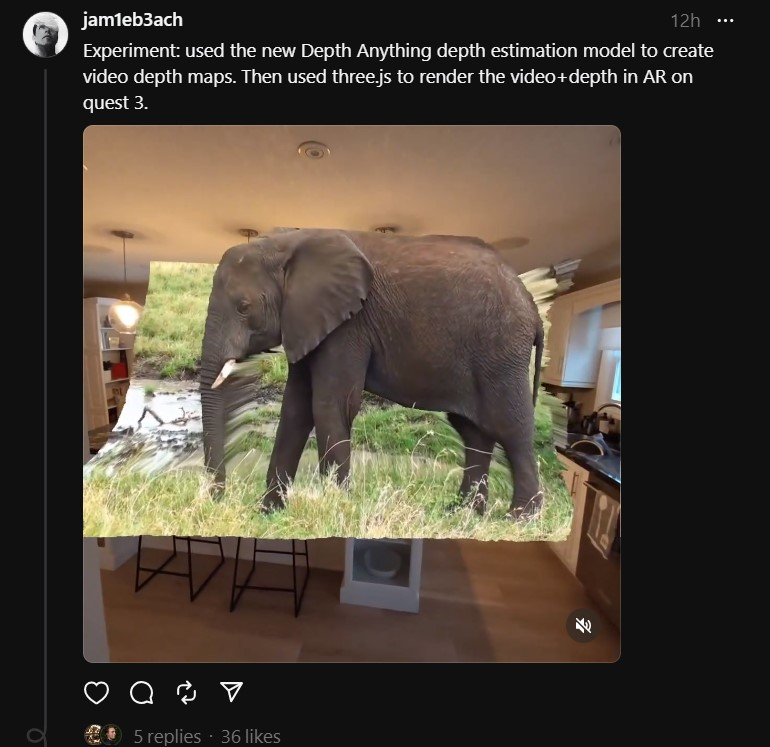
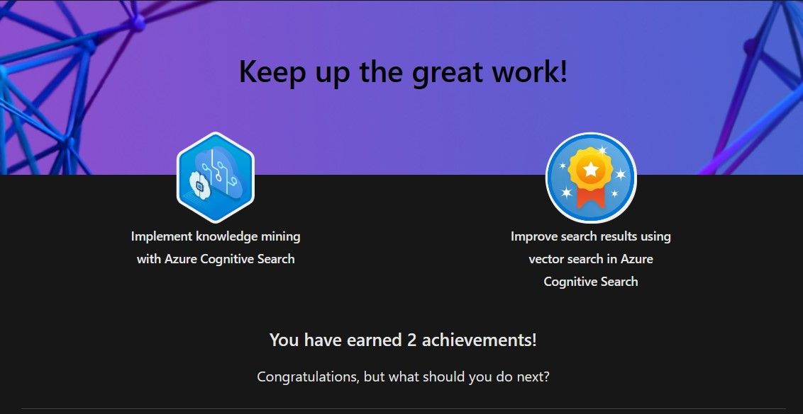
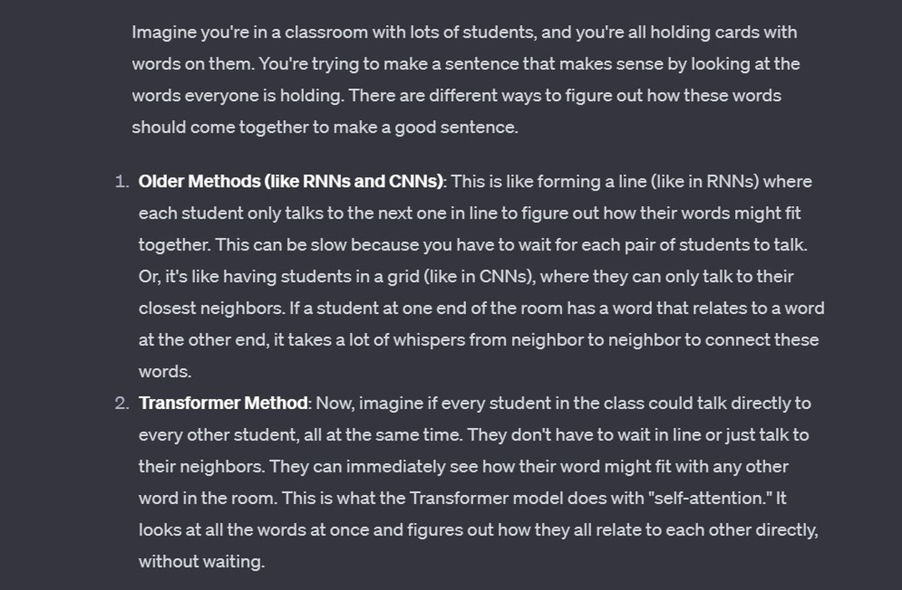
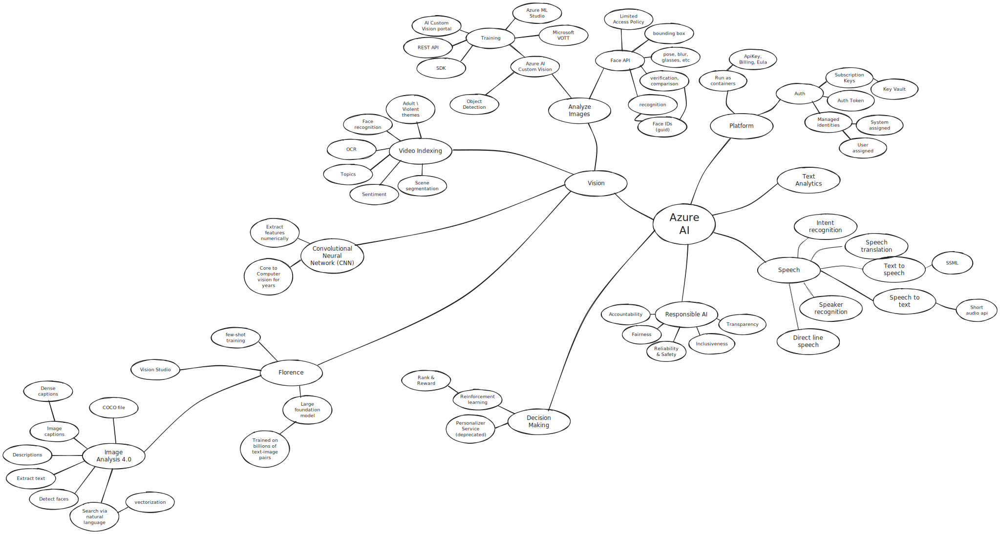
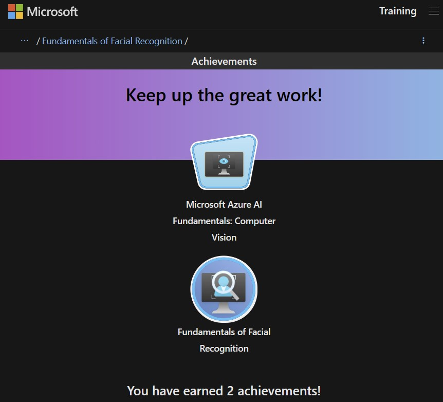

# Blog
---
## January-28
- I finished the codee for the Depth Anything model generated video depth-maps rendering with three.js app. Very cool. It had a fair bit of interest on Thread.net too.
- 
- I didn't release my code or publish it to my depthtube.com website yet. Still some work that I'd like to do with it.
- Late last night I also finished the show, Pantheon. Such an interesting show. Season 1 was all about the dawn of uploaded intelligence. Season 2 went at such a lightning pace. It reminded me of Greg Egan's Diaspora book. From the first episode of Season 2, had no idea that by the end we'd be talking about dyson spheres. (sorry for any spoiler there).
- Youtube video idea: how to setup a python environment on Windows with GPU accelerated CUDA and xFormers. I have a method for doing this that's fairly straight forward but I can't believe how difficult it usually is to get GPU accelerated CUDA + xformers working with windows python apps.
- Got to question 46 on the examtopics sample questions. Feeling pretty comfortable with the AI-102 exam. Will book tomorrow I think.

## January-27
- Saturday. Spent a fair bit of time this morning trying to render the 3d video + AI generated depth map in webxr using three.js. I learned the hard way that webxr isn't available if the web server isn't using https. And I was just using the live server on vscode and I spent hours trying to figure out why navigator.xr was not defined. :/ Eventually figured it out though and got something running. Just working on a few kinks and then will post online.

## January-26
- I spent some time this evening trying out an experiment with the  [Depth Anything](https://huggingface.co/posts/akhaliq/355654182325805) model. I was successfully able to run it on my machine, even with cuda and xformers. And I successfully created a video + depth map. I then tried to run the video + depth map in a 3d video player that I put together a couple years back using three.js, that rendered videos captured on iphone with Record3D. Unfortunately it didn't work for some reason. I'm going to try again and implement a new vertex and fragment shader for the depth map output that this model creates because it seems very very solid. In fact, I'd love to be able to make it render in an augmented mixed reality experience.
- Besides this experiment, I also watched [this neat TED Talk that](https://www.ted.com/talks/jim_fan_the_next_grand_challenge_for_ai) discusses a path to create foundational agent model, using transformers and leveraging the latest in 3d graphics for training environments. He talks about training on 10k "diverse simulated realities" which could maybe produce an agent scaled to be generalized for our physical world. Very cool talk.
- Also started going through questions from an AI-102 exam question site.

## January-25
- Went through a couple of lessons in the [Machine Learning, Data Science and Generative AI with Python](https://www.udemy.com/share/101W9O3@VqPjR6sljJFflMO_mBMY8Uscvj2cNVU9fw6gIJ3_CPRQtxm9pkSp6Rl7etLlW3dl/) course. Mostly about regression and fitting with multi-order polynomial equations. Also went through his lesson on naieve Bayes and spam filtering. I've seen that one many times before.
- Did a couple of lessons in the AI-102 path for Azure OpenAI. But two things :
    1. First, it's basically just OpenAI. So if you have ever used OpenAI Playground or the REST endpoints, you're gold.
    2. Second, Azure OpenAI isn't available to everyone - you need to apply and for individuals, it doesn't appear like you can easily get it. Which is a bummer. Despite this, the exam guide has a 10-15% OpenAI content.

## January-24
- Finished John Savill's AI-102 crash course video on Youtube. Not sure if it will help that much.
- Finished the Azure Document Intelligence module on the AI-102 learning path. That one was really quite uninteresting for me, for some reason. The next (and last) module on the learning path is Gen AI with Azure OpenAI. I'm hoping this one is interesting. Will start it tomorrow night.
- Continued learning matrix algebra. Read through some of Goodfellow's Deep Learning chatpter on linear algebra. He uses a lot of math notation to explain some things and as someone who isn't super familiar with it, I find myself constantly asking GPT4 to help me understand it further.

## January-23
- Interesting links:
    - [Probabilistic Machine Learning: An Introduction](https://probml.github.io/pml-book/book1.html)
- Did more AI-102 path - more document intelligence. Noticed that much of the Document Intelligence path is repeated numerous times. Kind of annoying. My notes actually reflect it a bit.
- I added some more to the Matrix python notebook, including a fair bit of detail on orthogonal matrices. Also added some code that will produce matrix multiplication problems.
- Above, I noted an interesting link : The full book, Probabilistic Machine Learning (Murphy) is available online at that link. It has a chapter that also goes deep into the math required for Machine Learning. It was first published in 2012 and has since been updated. Also(!) there are like 500 python notebooks available, on that link, that covers the entirety of the book. It's really quite incredible.

## January-22

- I started on the next unit in the AI-102 path
- Listened to another chapter of The Coming Wave. Really enjoying this book, despite it being very pessimistic of the future of AI.
- I also came across a number of neat links this morning from the Hugging Face Posts :
    - [Depth Anything](https://huggingface.co/posts/akhaliq/355654182325805) ([project page](https://depth-anything.github.io/))
    - [Axolotl GPU Poor LLM Fine-Tuning](https://github.com/OpenAccess-AI-Collective/axolotl)
    - [Transformers.js](https://huggingface.co/docs/transformers.js/index)
- And finally, I am nearly done with Savill's AI-102 crash course video. Watched some more tonight while lifting some weights.

## January-21
- Watched more of Savill's AI-102 crash course (just about 20 minutes to go)
- Listened to about an hour of The Coming Wave
- Created a [Matrix Algebra for Machine Learning study page here](./Maths/Matrix.ipynb).
- Finished reading the first chapter of Deep Learning.
- Finally finished all the Cognitive Search AI-102 self-paced training. More badges!
- 

## January-20
- I worked a bit more tinkering around with gradient descent. I used chatgpt again as a bit of a tutor. I'd ask it questions about gradient descent and then dig further into the subject, asking more questions. It's amazing how many new ways of learning are emerging.
- Some updates on the [gradient descent notebook](./Fundamentals/GradientDescent.ipynb) as a result.
- It's Saturday, so I got caught up with Mat Wolfe's new AI video. He spent a bit of time discussing the new Apple Vision Pro. I've spent quite a bit of time discussing AVP as well on Threads. It's going to be an interesting launch. Apple has sold out of initial stock and I'm certain it's going to continue to sell well, but I'm also seeing a lot of people unimpressed with the price tag and some other things. I really wonder where Apple is with respect to AI. I know they have been cointinuing to submit papers and their silicon has AI capabilities. But they don't seem to be at the forefront with this new AI paradigm for whatever reason and that's not good for them. Meanwhile, their Vision Pro competitor (Meta) has a multi-vector strategy and is leaning way more in on AI. In fact, Meta will be purchasing just as many new H100 AI accelerators as Microsoft will be in 2024. It's actually insane.
- Did another 2 units of AI-102 selt-learning. Still on Cognitive Search.
- Also went skiing this morning and listened to about an hour of The Coming Wave audiobook. 

## January-19
- Cointuined working on the [Maths ipynb notebook](./Maths/exercises.ipynb) with math things related to AI. Wen through conditional probability and bayes' theorem. 
- Worked through 2 units in the AI-102 course : Advanced Search features with Cognitive Search and building an Azure Machine Learning Custom skill with Azure Cognitive Search.
- I also created a [python notebook to review some fundamental concepts of gradient descent](./Fundamentals/GradientDescent.ipynb). I remember a fair bit of the basics from the Coursera course that I did in 2019, but thought I'd put something together to review again.

## January-18
- Spent a bit of time going through the math fundamentals from the  Machine Learning, Data Science and Generative AI with Python course on Udemy. I ended up [creating my own jupyter notebook](./Maths/exercises.ipynb) for it and used ChatGPT to add extra details around the various functions and topics. It's actually a pretty good primer on the statistics side of things.
- Did the knowledge store unit and lab as well as the enrichment with language studio lab in AI-102 self-paced. I'm going to need to start doing more than just a single unit per day. At this rate it will otherwise be a month before I'm completed all the units :/

## January-17
- Got through a couple more units on the AI-102 path.
- I tried doing the knowledge mining lab without using the setup scripts that they provided. Spent a good hour trying to fix something that I didn't do correctly before bailing. Clearly they provided setup scripts for a reason.
- Read the first chapter of Understanding Deep Learning, by Simon J.D. Prince. Seems like a good book. I took a look on ebay and Amazon and since it's a text book, it's quite expensive. Glad that the first 21 chapters are available for free. I just hate reading on my laptop :/

## January-16

I bought [Ian Goodfellow's Deep Learning text book](https://www.deeplearningbook.org/) in 2019, from ebay, I think. I never read it though. So tonight I started reading through the first chapter. I'm going to try and get through some of it - especially part 1 of the book that goes through the necessary math fundamentals. It's [free online](https://www.deeplearningbook.org/) and worth checking out.

Additionally, I was looking at the code for the build Bert from scratch tutorial from the [MiNT repo](https://github.com/dpressel/mint). There is some parts of it that I understand but others, no ideas. I think having some understanding of transformers at a high level is needed. So I turned to ChatGPT and asked for an ELI5 on Transformers. ChatGPT did not disappoint.

Found that Hugging Face now has a social network of its own on its site. Some interesting posts. Will be another source of daily AI news for me (and many others, I'm sure). -> [Hugging Face Posts](https://huggingface.co/posts)

Finished the Natural Language Processing module in the AI-102 learning path (finally).

## January-15
- Watched more of Savill's AI-102 cram video. 
- Did the AI-102 [Speech recognition and synthesis lab](./Certification%20-%20Azure%20AI%20Engineer%20Associate/labs/ai-language/07-speech/)
- When doing the speech synthesis lab, I was actually surprised about the quality of the voice synthesis. I'm used to ElevenLabs voice synth and Microsoft's voices were actually pretty good. MS has a voice gallery as well, located here : [https://speech.microsoft.com/portal/voicegallery](https://speech.microsoft.com/portal/voicegallery).
- I was using LM Studio with Mistral 7b instruct today and was once again amazed at the fact that I was running this AI with such broad knowledge and high inferencing capabilities on my laptop. I just can't wrap my head around the fact that all it takes is a roughly 5gb model file. It's truly mind blowing.

## January-14
Woke up this morning and got caught up on all the AI happenings at CES 2024 with [Matt Wolfe's new CES coverage video](https://youtu.be/H91PyQjuw2Y?si=pbm7B6vqvpasPTFx). I think I also saw some tweets this am that if people see the word, AI, one more time they will lose it.

I also spent some time trying to organize my AI-102 notes into a mind map. I used excalidraw and uploaded the [WIP file to this repo](./images/excalidraw/azure-ai-mindmap.excalidraw).

I found a link online, from a reddit post, of a github library that has some transformer models from scratch. It's called [MinT : Minimal Transformer Library and Tutorials](https://github.com/dpressel/mint). Looks interesting and was recommended as a study aid for transformers and LLMs. Added it to the resources list.

I finished the night with another unit from AI-102 learning path.

## January-13
I spent a good chunk of time today going through LM Studio and recorded a video showing how well it runs on a fairly mediocre computer.

Otherwise, I also spent a tiny bit of time on the AI-102 path, using Azure AI Service for entity extraction. Not as interesting as LLMs, admittedly.

## January-12
Today :
- Went through another unit in the AI-102 self paced learning - [Create a custom text classification solution](https://learn.microsoft.com/en-us/training/modules/custom-text-classification/).
- Spent some time reformatting the RESOURCES.md file
- Read through the chapter in [The State of Open Source AI about fine tuning](https://book.premai.io/state-of-open-source-ai/fine-tuning/).
- Watched a couple of youtube videos that reviewed LLMs
  
## January-11
This morning, I got through another hour of the AI-102 learning path. More delving into the natural language processing capabilities in Azure. I do wonder, however, if a number of these capabilites are really as significant as they may have been in previous years. NLP and language understanding have taken a sharp turn with ChatGPT and transformer based models in the last couple of years. So much so that larger LLMs are able to handle many of the more discrete capabilities that are built out in PaaS capabilities like the Azure AI Services... I dunno.. just a thought.

Tonight, I started exploring fine-tuning LLMs. I've used LoRAs with Stable Diffusion through ComfyUI many times. Most recently, using the various Christmas LoRAs when generating some fun Christmas poem videos ([see here](https://www.threads.net/@jam1eb3ach/post/C09-oxiriJn)). However, I really had no idea how to create them. I ended up on youtube and watched [this great video](https://www.youtube.com/watch?v=eC6Hd1hFvos) about what LoRA's are and how to create one for fine-tuning a language model. It's a great video and highly recommended if you're interested in the same. I also created a new section in this repo called [LLM](./LLM) and added [a markdown that explains Fine Tuning](./LLM/Fine-Tuning.md).

This video came from a [series of videos by Shaw Talebi about Large Language Models](https://www.youtube.com/watch?v=tFHeUSJAYbE&list=PLz-ep5RbHosU2hnz5ejezwaYpdMutMVB0) which look really good. Bookmarking!

## January-10
I saw some tweets this morning about how GPT-4 is getting increasingly "lazy" and some innacuracies or unfinished responses being observed more often. In response, some people suggested running LLMs like [Mistral 7B](https://mistral.ai/news/announcing-mistral-7b/) which is touted as the best 7B open source model available to date. Some people then responded that it isn't possible to run this without high vram, but that is incorrect. It's possible to run quantized versions of Mistral without any vram. As a test, I used [LM Studio](https://lmstudio.ai/) and was able to get some answers to some non-intuitive problems and the performance was quite quick when using the right version of Mistral.

Aside : What does quantization mean anyway? And how does one quantize a model? Note to self: explore this...

This evening I spent quite a bit of time playing around with LM Studio and varoius language models. Unfortunately I did not have great success. Maybe it was because I was running it from a Linux image on an sd card, but it was giving me some very strange results and then I couldn't open a model any longer.

This evenint I also spent some more time going through the AI-102 training, knocking off another module. I didn't get a chance to do much else unfortunately. The evening was busy.

## January-9
I took the train into Toronto today. I nearly got on the wrong train heading back home. Actually I **did** get on the wrong train heading home, but fortunately got on the right train line and was able to hop-off-hop-on to get on the right train. Phew!

During the train to the office, I managed to get through a couple of modules on the AZ-102 certification learning path. Completed the computer vision section and moved onto the language processing section.

I'm listening to a science-fiction, [Robopocalypse, by Daniel H. Wilson (2011)](https://en.wikipedia.org/wiki/Robopocalypse) and it's a pretty sweet story about a human unleashing uncontrollable AI. I'm very much enjoying it and managed to get a few chapters in as well on the train. The problem I'm having is that I end up not listening for stretches or, like last night, I fall asleep and wake up 12 further chapters into the book but no idea what happened. So I'm having to rewind quite a bit. But highly recommended if you are on the hunt for AI related science fiction.

I finished one of the Microsoft Ignite: Azure AI Vision challenge. Part of it was exploring the Image Analysis 4.0 capabilities and get a better understanding of the improvements that have been made with the use of Florence.

Got me some sweet badges.

## January-8
I go for walks most mornings to kick start the day. This morning was no exception and while getting some steps in, I listened to the first 30 minutes or so of a recently puslished book - [The Coming Wave: Technology, Power and the Twenty-first Century's Greatest Dilemma, by Mustafa Suleyman and Michael Bhaskar](https://www.amazon.com/Coming-Wave-Technology-Twenty-first-Centurys/dp/0593593952). Only that far in and I'm getting quite a picture that this is a great book. It reminds me a bit of Life 3.0 mixed with Superintelligence. Definitely getting the "urgent warning" vibes and looking forward to listening to the rest. I'm headed to Toronto tomorrow so expecting that I'll get quite a bit of listening in then.

Interestingly, today starts CES 2024. There were a couple of keynotes that I caught today. Most notibly were the keynotes from both AMD and Nvidia. Both companies introduced some new tech related to AI (and gaming). Nvidia announced the much discussed RTX Super series of cards and showed off some interesting  demos, like the discussions with NPC characters in a game that uses LLM + voice synth. AMD also announced a new graphics card as well as the 8000 series APUs that will be able to run games like Cyberpunk 2077 in 1080, with all the good effects, without a dedicated GPU card. AMD also discussed a lot about their foray into AI.

The AMD keynote actually made me look into ROCm and ONNX a little more and although a few years old now, ONNX (a non-platform specific ML framework) seems to have a lot of promise. I'm interested in reading through the book, The State of Open Source AI, to get some more insight in to this and maybe other "write once run everywhere" capabilities for ML that could help boost competition in the AI silicon space.

This evening, I did a few modules in Computer Vision on the self-paced AI-102 lerning track. And once again, got a tiny bit more of the Savill study cram in while... you guessed it, lifting some weights.

## January-7
- Found some recent books on AI. I've read some great AI books in the past, including Life 3.0, Superintelligence. Found some books that I'll start getting into. At first, I found 2084 on Amazon with really positive ratings but then delved into the ratings on Goodreads and found some scathing reviews - "Lennox feels that he can disregard credible scientific information, quote the bible as his source of evidence for ridiculous, completely illogical arguments... And then turn around and act like he himself is a man of science." - yikes!
- Worked through the AI-102 Azure AI Service lab, using an Azure AI container. It's interesting that Microsoft makes their containers available for local runtime and are still able to apply billing back to your subscription. I ran the language detection container on an Azure Container Instance. Which took a really long time to get running. I also found that the first time I ran the service, it took a fairly long time to instantiate and run. Consecutive attempts ran pretty quickly.
- Sidenote : Azure container repo URI : https://mcr.microsoft.com/en-us/catalog?page=1
- I quickly then deleted the container instance to avoid charges.
- Started next module in AI-102 self-paced track, introducing decision support capabilities.
- Did the Analyze Images lab in the self-paced learning track
- Watched another 30 minutes of [John Savill's Azure AI-102 Study Cram](https://youtu.be/I7fdWafTcPY?si=d9l-gEwqddqYiAmx) video - again while working out in my basement gym.
 
## January-6
So here I go again. Trying to jam in as much learning as I can about AI. Intending to use this markdown file as a mechanism to blog about it all. Previously when I did this, I documented the whole journey in [Trello, here](https://trello.com/b/g1cS5K0O) and wrote about the top 5 insights I learned, [here in a Medium article](https://medium.com/swlh/top-5-insights-after-i-spent-100-days-learning-about-artificial-intelligence-b14b44a67134). This time, I'm just going to put it all in my github account. This has become the place where I mostly write anyway.

I'm going to commit to 30 minutes per day of learning. This doesn't include writing in the journal here. I'm hopeful to be able to spend considerable more time than that, but I have work and family and I also need to keep my Duolingo streak going 😉.

To start, between last night and this morning, I've spent roughly 1.5 hours on courses.

I have already certified in a number of Microsoft Azure certs, including AI-900, but will go for the AI-102 certification which seems a little more comprehensive than AI-900. Given my background, I expect I'll be able to do this in less than the 40 - 50 hours I've calculated as the bare minimum if you're going in cold. Will see. Certifications always catch me off guard with how much effort I really need to remember it all. I'm also going to have to spend some time brushing up in order to renew my other unrelated certs, due March, so may have to take a break from this.

Besides the AI-102 certification, I'm refreshing everything I learned in 2019 with what looks like a great review course on Udemy called [Machine Learning, Data Science and Generative AI with Python](https://www.udemy.com/share/101W9O3@VqPjR6sljJFflMO_mBMY8Uscvj2cNVU9fw6gIJ3_CPRQtxm9pkSp6Rl7etLlW3dl/) from [Frank Kane at Sundog Education](https://www.sundog-education.com/course/machine-learning-data-science-and-deep-learning-with-python/). This is to start at least, but should take a number of weeks to finish. I'll also explore some podcasts and keep up to date via the various experts I follow on Threads and the YouTube channels I subscribe to. Who knows, I may even do either of those as part of this all.

So this is my first post. If you are reading this, hopefully it all ends up helping or being interesting at least.

### Today :
- Watched 30 minutes of [John Savill's Azure AI-102 Study Cram](https://youtu.be/I7fdWafTcPY?si=d9l-gEwqddqYiAmx) video while working out in basement gym
- Listend to a couple of Practical AI podcasts (while driving with fam to Toronto and back)
- AI-102 self-paced study path (30 minutes)
- Machine Learning Udemy Course (15 minutes)
- Watched [Matt Wolfe's latest AI update](https://youtu.be/RGsZrqa2Iss?si=hAJtmaaCVzWOihUg)
- Started Microsoft Skills Challenge : [Ignite Azure Vision](https://learn.microsoft.com/training/challenges?id=bf3c5e50-6ea9-47b6-86e5-3cfe22e1e626&WT.mc_id=cloudskillschallenge_bf3c5e50-6ea9-47b6-86e5-3cfe22e1e626&ocid=ignite23_CSC_sbanner2_cnl) (20 minutes)